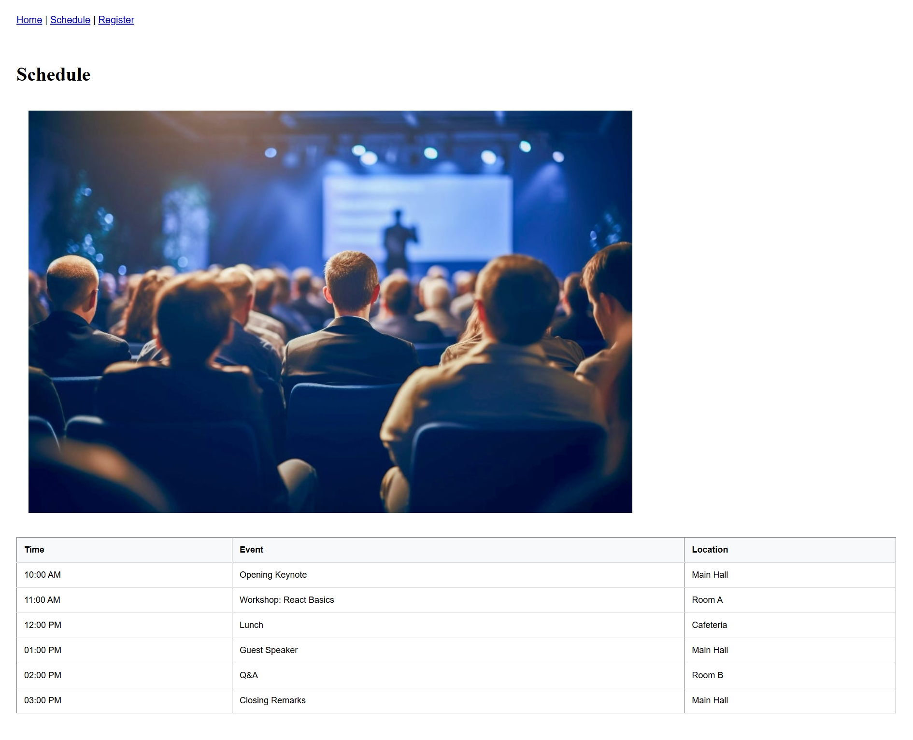

My project: https://csc336-fall2025-1-ytfc.onrender.com (web_service version)
https://csc336-fall2025-2-final.onrender.com (static_version)

(i would then go to final/server then run node server.js for it to load)
For some reason (probably a mistake on my part), the render website wouldn't let me use the server file and simply "node server.js" to display the information, so you'll have to do that on vs code. 

This project is supposed to be a simple website, where you get a home page of an organization, then get to see the schedule of events coming up (data retrival with GET /api/schedule) as well as (POST api/register), for the register page, which handles form submission and saves registration records to a local JSON file.

There are three "pages" in total. You can navigate using the router-header on the top of the page.

For the schedule page, the 'schedule' and conference image on the page is the data retrival, and on the register page, you can enter your name and email to register for the day. There are restrictions for what is allowed (such as not being able to register the name email more than once).

I used express, cors, body-parser, toast, react, react-dom, vite and devDependencies (for tools).

here is an image of the schedule page and how it's supposed to look (I got it onto render on my side at the least)

here is a video of the register page and how it functions: (I got it onto render on my side at the least) (file name is "register_record 09-12-25.mp4")
<video controls src="register_record 09-12-25.mp4" title="Title"></video>